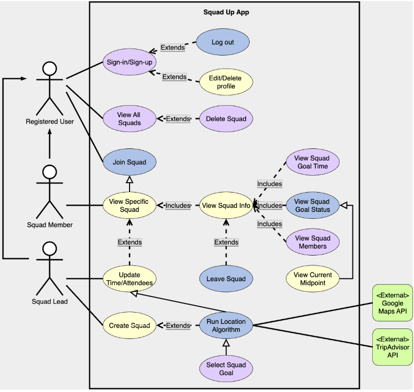
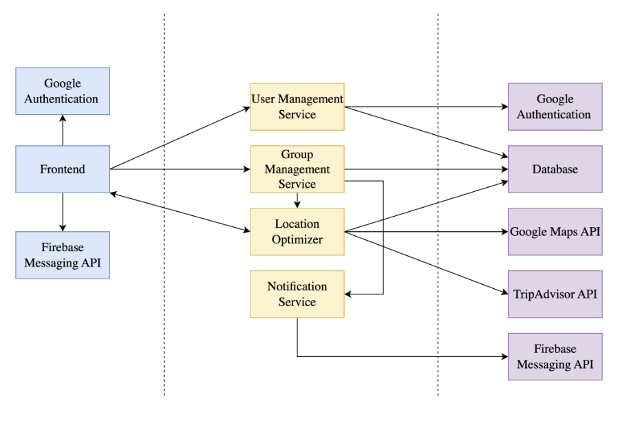

# Requirements and Design

## 1. Change History

| **Change Date**   | **Modified Sections** | **Rationale** |
| ----------------- | --------------------- | ------------- |
| _Nothing to show_ |

---

## 2. Project Description

The target audience for SquadUp is anybody who hates dealing with dead group chats, last-minute RSVPs, or the headache that comes with figuring out a gathering place when trying to celebrate an occasion. This demographic includes students, young professionals, and community groups with members spread out over a geographical area – anybody with a busy schedule that doesn’t have time to read through long text threads and supply input on the plan.

SquadUp aims to solve the friction of planning group meetups: long back-and-forth chats, infrequent communication, and disagreements over where to meet. By having one Squad Leader create the event with a given time, Squad Members can input their locations in order to receive a list of meeting place suggestions. The suggestions will be calculated using a “midpoint” calculation algorithm, using relative location data from the Google Maps API and rating data from the TripAdvisor API, and the selected activity/venue will be called the Squad Goal.

One of the most interesting technical highlights of the MeetUp Planner project is the combined optimization of using the Google Maps and Tripadvisor APIs. This enables the app to propose meetup options that are both time-feasible and geographically fair—such as suggesting a café that minimizes total travel time for the group.

---

## 3. Requirements Specification

### **3.1. List of Features**
#### User Management
- Sign up/in  
- Log out  
- Edit profile  
- Delete profile  

#### Squad Management
- Create squad  
- Join squad  
- View all squads  
- View specific squad  
- Leave squad  
- Delete squad  

#### Squad View
- View event time  
- View current midpoint  
- View attendees  
- View squad goal / squad status  

#### Update Squad
- Update the expected number of people  
- Update event time  
- Find squad goal (run location algorithm)  
- Select squad goal (select venue/activity)  

### **3.2. Use Case Diagram**

### **3.3. Actors Description**
#### Registered User
A registered user is somebody who can create and join events. Their home page will contain a list of all event groups they are currently a part of, as well as archived groups of past events.

#### Squad Leader
The Squad Leader will be the registered user who creates the group with the intention of sorting out an event. They create a group, input the meeting time, date, and expected number of group members, send out the invite code to join, and decide on the final meeting place once the algorithm has run.

#### Squad Member
A Squad Member will be any registered user who joins an event created by a Squad Leader. They join the group, input their location before the event, and wait for the decision on a meeting place.

### **3.4. Use Case Description**

#### Use cases for feature 1: **User Management**
1. **Sign up/in**: The user is able to sign up using Google Authentication. Afterwards, the user is able to sign in to their registered account with the same Google credentials.  
2. **Log out**: The user is able to log out of their account if they are currently signed in.  
3. **Edit profile**: The user is able to edit their profile information, such as transit type, while logged in.  
4. **Delete profile**: The user is able to delete their profile while they are currently signed in.  

#### Use cases for feature 2: **Squad Management**
1. **Create squad**: A registered user can create a new squad by entering event details such as time, radius, and purpose.  
2. **Join squad**: A registered user can join an existing squad using an invitation code, then provide their location information.  
3. **View all squads**: A registered user can see an overview list of all squads they are currently a part of.  
4. **View specific squad**: A squad member can click on a particular squad to view its details, including members, planning status, and location suggestions.  
5. **Leave squad**: A squad member who can no longer participate in the event can leave the squad, which may trigger the group leader to rerun the midpoint calculation.  
6. **Delete squad**: A squad leader can delete their squad if the event is canceled or no longer relevant.  

#### Use cases for feature 3: **Squad View**
1. **View event time**: A squad member can check the scheduled time of the event to plan accordingly.  
2. **View current midpoint**: A squad member can see the calculated geographic midpoint based on all attendees’ locations.  
3. **View attendees**: A squad member can view the list of members currently in the squad.  
4. **View squad goal/squad status**: A squad member can see the selected squad goal (final meeting place/activity) or view the current planning status if no goal has been chosen.  

#### Use cases for feature 4: **Update Squad**
1. **Update expected number of people**: The squad leader can adjust the estimated number of attendees to refine planning.  
2. **Update event time**: The squad leader can modify the event’s scheduled time if the group agrees to a change.  
3. **Run location algorithm**: The squad leader can trigger a recalculation of midpoint and activity suggestions when new information is added or members change.  
4. **Search radius for potential squad goals (activities)**: The squad leader can adjust the search radius to broaden or narrow the scope of suggested venues.  
5. **Select squad goal (event’s destination and activity)**: The squad leader can finalize the chosen meeting place and activity, confirming it as the event destination.  

### **3.5. Formal Use Case Specifications (5 Most Major Use Cases)**

#### Use Case 1: Create Squad

**Description**: A registered user creates a new squad by entering event details such as time, radius, and purpose.  

**Primary actor(s)**: Registered user (Squad Leader).  

**Main success scenario**:
1. User opens the “Create Squad” screen.  
2. User inputs required fields (event time, radius, event name, activity category).  
3. System validates input format (e.g., time format, numeric radius).  
4. System creates a new squad record with a unique ID.  
5. Squad is stored in the database and visible in the user’s “My Squads” list.  

**Failure scenario(s)**:
- 2a. Input time/radius/activity is invalid  
    - 2a1. User is prompted to re-enter information.  

---

#### Use Case 2: Join Squad

**Description**: A registered user joins an existing squad using an invitation code and provides their location information.  

**Primary actor(s)**: Registered user (Squad Member).  

**Main success scenario**:
1. User navigates to “Join Squad.”  
2. User enters valid squad invitation code.  
3. System validates code and squad existence.  
4. User provides valid location information.  
5. System adds user to squad’s attendee list.  
6. Squad details are updated and visible to all members.  

**Failure scenario(s)**:
- 2a. User’s invitation code is invalid  
    - 2a1. System notifies user code is invalid.  
    - 2a2. User is prompted to re-enter invitation code.  

- 4a. User’s location information is invalid (different region/country than squad leader).  
    - 4a1. System notifies user location is invalid.  
    - 4a2. System suggests a location closer to squad leader.  

---

#### Use Case 3: View Specific Squad

**Description**: A squad member can view the squad’s details, including members, planning status, and location suggestions.  

**Primary actor(s)**: Squad member.  

**Main success scenario**:
1. User selects a squad from “My Squads.”  
2. System retrieves squad details from the database.  
3. System displays squad name, event time, member list, current midpoint, and status.  

**Failure scenario(s)**:
- 2a. Squad has been deleted by Squad Leader.  
    - 2a1. User is notified squad has been deleted.  
    - 2a2. Squad is removed from user’s squad list page.  

---

#### Use Case 4: Run Location Algorithm

**Description**: The squad leader runs the location algorithm to recalculate midpoint and suggest activities.  

**Primary actor(s)**: Squad Leader.  

**Main success scenario**:
1. Squad leader clicks “Find Squad Goal.”  
2. System retrieves all current member locations.  
3. Algorithm calculates a midpoint.  
4. System fetches venue/activity suggestions from APIs (Google Maps, TripAdvisor) within radius around midpoint.  
5. System filters results based on relevancy (ratings, activity type, hours).  
6. Results are displayed to all members.  

**Failure scenario(s)**:
- 4a. No venues/activities within radius of midpoint.  
    - 4a1. System notifies squad leader no results found.  
    - 4a2. System suggests closest alternative midpoint with higher venue density.  
    - 4a3. System updates midpoint and notifies members.  

- 5a. All venues/activities fetched are closed during event time.  
    - 5a1. System notifies squad leader no open venues.  
    - 5a2. System suggests updating event time.  
    - 5a3. If accepted, system updates event time in backend.  
    - 5a4. System notifies members of updated event time.  

---

#### Use Case 5: Select Squad Goal

**Description**: The squad leader finalizes the selected squad goal (event’s destination and activity).  

**Primary actor(s)**: Squad Leader.  

**Main success scenario**:
1. Squad Leader selects a suggested venue/activity from the list.  
2. System updates Squad information with the final goal.  
3. System notifies members of updated goal and status.  

**Failure scenario(s)**:
- 1a. A member leaves after Squad Goal is chosen, changing algorithm parameters.  
    - 1a1. System notifies Squad Leader that a member has left.  
    - 1a2. System asks Squad Leader if they want to discard current Squad Goal.  
    - 1a3. If Squad Leader discards, system updates Squad Status for all users.  
    - 1a4. System redirects Squad Leader to “Find Squad Goal” page.  

### **3.6. Screen Mock-ups**

### **3.7. Non-Functional Requirements**

1. **Location Optimization Response Time**
    - **Requirement**: The system shall return location optimization results (midpoint calculation and venue suggestions) within 2 to 5 seconds of the squad leader triggering the algorithm.  
    - **Justification**: Location optimization is the core feature of SquadUp. If results take too long, users lose patience and the app fails at its main promise of simplifying group planning. Research on web/app usability shows that 31% of participants found a 2-second delay acceptable, and less than 20% tolerated a 5-second delay. Therefore, we aim for ideally 3 seconds, with a lower bound of 2 seconds and upper bound of 5 seconds. Latency also affects scalability.  
    - **Testability**: This can be validated using UI tests (measure time from button click to results rendered) and API load tests (measure server-side algorithm runtime and API latency).  

2. **Squad View Load Time**
    - **Requirement**: The system must load squad details (attendees, event time, squad status) within 2 seconds after a user selects a squad.  
    - **Justification**: Squad View is the most frequently accessed screen. Ensuring quick load maintains user engagement and supports the app’s goal of frictionless event coordination. Human–computer interaction studies suggest actions should respond within 1 second to feel fluid and keep user attention.  
    - **Testability**: This can be measured with UI performance tests (screen render time after click) and API profiling (database query and response time checks).  

#### References: 
Khiem, M., Guntur Ravindra, & Ooi, W. T. (2011). Towards understanding user tolerance to network latency in zoomable video streaming. Proceedings of the 30th ACM International Conference on Multimedia, 977–980. https://doi.org/10.1145/2072298.2071917

Nielsen, J. (1993, January 1). Response Time Limits: Article by Jakob Nielsen. Nielsen Norman Group. https://www.nngroup.com/articles/response-times-3-important-limits/

---

## 4. Designs Specification
## 4. Design Specification

### **4.1. Main Components**

1. **User Management Service**
    - **Purpose**: Handles user authentication, authorization, and profile CRUD (e.g., name, email, travel preferences).  
    - **Rationale**: Users persist across multiple events, so identity must be managed independently of event data. Keeping this service separate allows easy integration with third-party auth providers (Google, SSO) and ensures security boundaries are clear.  

2. **Group Management Service**
    - **Purpose**: Provides CRUD operations for events and manages their participant lists. Since groups are single-use, event records also serve as the representation of group membership.  
    - **Rationale**: Folding group logic into event management avoids redundancy and simplifies the model. This keeps all participation and scheduling information in one place, reducing coupling and making the service easier to extend.  

3. **Location Optimizer**
    - **Purpose**: Calculates fair meetup spots for events by combining group members’ locations with external APIs (Google Maps for travel times, TripAdvisor for ratings).  
    - **Rationale**: Isolating the optimization logic as a dedicated service prevents the event service from becoming bloated with complex computation and API integration. It also makes it easier to swap or extend algorithms (e.g., adding a density-based or ML-driven approach later).  

4. **Notification Service**
    - **Purpose**: Sends timely updates to users, including RSVP confirmations, reminders, and last-minute changes, via email or push notifications.  
    - **Rationale**: Running notifications as an asynchronous background service prevents delays in the main user workflow. Decoupling also allows the system to scale independently and adopt different channels (email, SMS, push) without touching core event logic.  

### **4.2. Databases**
1. **MongoDB**
    - **Purpose**: Storage of all user and group information.
    - **Reasoning**: We decided to choose a NoSQL database that stores events, squads and user data in flexible JSON-like documents. MongoDB was selected over relational databases because SquadUp’s data structures are semi-structured and expected to evolve such as new event preferences or squad features 

### **4.3. External Modules**
1. **Google Maps API** 
    - **Purpose**: Midpoint calculations, travel times and venue suggestions.
2. **Google Authentication** 
    - **Purpose**: Secure user login.
3. **Tripadvisor API** 
    - **Purpose**: Venue Suggestions
4. **Firebase Cloud Messaging** 
    - **Purpose**: Reliable and scalable infrastructure for sending real-time notifications to users on Android.

### **4.4. Frameworks**
1. **Android SDK (Kotlin/Java)**
    - **Purpose**: Mobile app development.
    - **Reason**: Native Android support.
2. **Jetpack Compose:**
    - **Purpose**: UI Toolkit
    - **Reason**: Jetpack Compose provides a modern, declarative UI toolkit for Android, allowing faster development and easier UI updates compared to traditional XML layouts. Combined with Kotlin, it simplifies building responsive and maintainable native Android interfaces for SquadUp.
3. **AWS:**
    - **Purpose**: Backend Server Hosting
    - **Reason**: Reasons: We decided to choose a NoSQL database that stores events, squads and user data in flexible JSON-like documents. MongoDB was selected over relational databases because SquadUp’s data structures are semi-structured and expected to evolve such as new event preferences or squad features.
4. **Node.js with Express.js + Typescript:**
    - **Purpose**: Backend Server development
    - **Reason**: Reasons: TypeScript improves reliability with static typing while Express offers a flexible API layer. This combination makes it easier to scale and maintain the backend as SquadUp grows

### **4.5. Dependencies Diagram**

### **4.6. Use Case Sequence Diagram (5 Most Major Use Cases)**
1. [**[WRITE_NAME_HERE]**](#uc1)\
[SEQUENCE_DIAGRAM_HERE]
2. ...

### **4.7. Design and Ways to Test Non-Functional Requirements**
1. [**[WRITE_NAME_HERE]**](#nfr1)
    - **Validation**: ...
2. ...
