# Requirements and Design

## 1. Change History

| **Change Date** | **Modified Sections** | **Rationale** |
| --------------- | ------------------- | ------------- |
| 2025-10-30 | 3.1, 3.4, 3.5 | Added missing “Recommended Locations” project use case under “Update group” feature based on M2 feedback. Refined use case granularity and alignment with project description. |
| 2025-10-30 | 3.2 | Update the use case diagram based on M2 feedback. |
| 2025-10-30 | 3.5 | Update formatting of formal use case specification, and removed implementation details from success scenarios. Update the button and workflow details of the formal use case specifications to align with the current implementation of the app. Update formal use case specifications with external APIs as actors. Removed TripAdvisor API due to obsolete API integration needs. Calculated only 1 midpoint for MVP rather than 3. 3 midpoint functionality has been implemented in the backend for a future version. Removed radius specification from squad leader input and handled this as a default value in the backend to reduce user enacted failure scenarios. |
| 2025-10-30 | 3.3 | Update actors with external APIs. |
| 2025-10-30 | 3.4 | Update the use case description for the added “View recommended locations” algorithm based on feedback. Updated use case names to align with use case diagram, and changed ‘Squad’ to ‘Group’ to remove confusion. |
| 2025-10-30 | 3.6 | Inserted the Figma prototypes to screen mock-up section. |
| 2025-10-30 | 4.5 | Dependencies diagram updated based on Firebase edge feedback from M2. |
| 2025-10-30 | 4.1, 4.7 | Updated for M3. |
| 2025-11-28 | 3.1–3.4 | Updated Create Group use case with automatic midpoint update; updated use cases with the new **View Travel Time** feature; updated the use case diagram to include **View Travel Time** and **Update Midpoint Automatically**. |

---

## 2. Project Description

The target audience for SquadUp is anybody who hates dealing with dead group chats, last-minute RSVPs, or the headache that comes with figuring out a gathering place when trying to celebrate an occasion. This demographic includes students, young professionals, and community groups with members spread out over a geographical area – anybody with a busy schedule that doesn’t have time to read through long text threads and supply input on the plan.

SquadUp aims to solve the friction of planning group meetups: long back-and-forth chats, infrequent communication, and disagreements over where to meet. By having one Squad Leader create the event with a given time, Squad Members can input their locations in order to receive a list of meeting place suggestions. The suggestions will be calculated using a “midpoint” calculation algorithm, using relative location data from the Google Maps API.

One of the most interesting technical highlights of the MeetUp Planner project is the optimization of using Google Maps and user inputs. This enables the app to propose meetup options that are both time-feasible and geographically fair—such as suggesting a café that minimizes total travel time for the group.

---

## 3. Requirements Specification

### **3.1. List of Features**
#### User Management
- Sign up/in  
- Log out  
- Edit profile  
- Delete account  

#### Group Management
- Create group  
- Join group  
- View all groups  
- View specific group  
- Leave group  
- Delete group  

#### Group View
- View event time  
- View current midpoint  
- View attendees  
- View selected activity
- View travel time
- View recommended locations  

#### Update Group
- Update expected people  
- Update event time  
- Update member address  
- Update member transit
- Update midpoint automatically
- Find midpoint  
- Select activity  

### **3.2. Use Case Diagram**
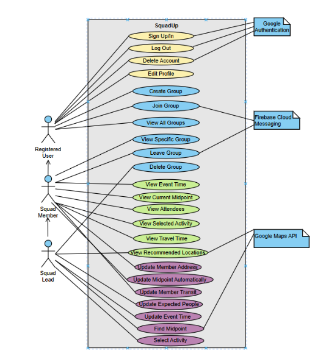
### **3.3. Actors Description**
#### Registered User
A registered user is somebody who can create and join groups. Their home page will contain a list of all groups they are currently a part of.

#### Squad Leader
The Squad Leader will be the registered user who creates the group with the intention of sorting out an event. They create a group, input event information, send out the invite code for other members to join, and decide on the final activity once the algorithm has run to get the midpoint.

#### Squad Member
A Squad Member will be any registered user who joins a group created by a Squad Leader. They join the group, input their information, and wait for the decision on a meeting place.

#### Google Maps API
External API that provides geolocation, distance matrix, and nearby place recommendations for midpoint and venue calculation.

#### Firebase Cloud Messaging (FCM)
External service used to deliver push notifications (updates, reminders) from the backend to the Android frontend.

#### Google Authentication
External API that provides user authentication services. 

### **3.4. Use Case Description**

#### Use cases for feature 1: **User Management**
1. **Sign up/in**: The user is able to sign up using Google Authentication. Afterwards, the user is able to sign in to their registered account with the same Google credentials.  
2. **Log out**: The user is able to log out of their account if they are currently signed in.  
3. **Edit profile**: The user is able to edit their profile information, such as transit type, while logged in.  
4. **Delete account**: The user is able to delete their profile while they are currently signed in.  

#### Use cases for feature 2: **Group Management**
1. **Create group**: A registered user can create a new group by entering event details such as name, time and date, expected number of people, and activity type, and choose if they want the midpoint to be updated automatically.
2. **Join group**: A registered user can join an existing group using an invitation code, then provide their location information.  
3. **View all groups**: A registered user can see an overview list of all the groups they are currently a part of.  
4. **View specific group**: A Squad Member can click on a particular group to view its details, including the leader’s name, member list, midpoint status, and selected activity if available.  
5. **Leave group**: A Squad Member who can no longer participate in the event can leave the group, which may trigger the group leader to rerun the midpoint calculation.  
6. **Delete group**: A Squad Leader can delete their group if the event is cancelled or no longer relevant.  

#### Use cases for feature 3: **Group View**
1. **View event time**: A Squad Member can check the scheduled time of the event to plan accordingly.  
2. **View current midpoint**: A Squad Member can see the calculated geographic midpoint based on all members’ locations.  
3. **View attendees**: A Squad Member can view and search the list of members currently in the group.  
4. **View recommended locations**: After the midpoint location algorithm is run, the Squad Leader can view the list of activities around the midpoint for their desired activity type.
5. **View Travel Time**: After the midpoint location algorithm is run and an activity is selected, the members can view the travel time from their starting location to the selected activity. 
6. **View selected activity**: A Squad Member can see the selected activity (final meeting place/activity) or view the current planning status if no goal has been chosen.  

#### Use cases for feature 4: **Update Group**
1. **Update expected people**: The Squad Leader can adjust the estimated number of attendees to refine planning.  
2. **Update event time**: The Squad Leader can modify the event’s scheduled time if the group agrees to a change.  
3. **Update member address**: The Squad Member can update the location they’ll be departing from.  
4. **Update member transit**: The Squad Member can update the form of transportation they’ll be using to get to the midpoint.  
5. **Find midpoint**: The Squad Leader can trigger a recalculation of the midpoint and activity suggestions when new information is added or members change.  
6. **Select activity**: The Squad Leader can finalize the chosen meeting place and activity, confirming it as the event destination.
7. **Update Midpoint Automatically**: The Squad Leader can choose to update the midpoint automatically anytime members update their address or transit type in the member settings page, or if the leader updates the activity type in the member settings page.

### **3.5. Formal Use Case Specifications (5 Most Major Use Cases)**

#### Use Case 1: Create Group

**Description**: A registered user creates a new Group by entering event details such as time, date, and type.  

**Primary actor(s)**: Registered user.  

**Main success scenario**:
1. User inputs the Group Name into the input field.  
2. User selects meeting date from the “Select Meeting Date” button.  
3. User selects meeting time from the “Select Meeting Time” button.  
5. User inputs Expected People into the input field.  
6. User selects Activity Type from the dropdown field.  
7. User clicks “Create Group” button.  

**Failure scenario(s)**:
- 1a. Input fields are invalid  
    - 1a1. User is prompted to re-enter information correctly.  

#### Use Case 2: Join Group

**Description**: A registered user joins an existing Group using an invitation code and provides their location information.  

**Primary actor(s)**: Registered user, Firebase Cloud Messaging.  

**Main success scenario**:
1. User clicks the people icon on the bottom navigation menu.  
2. User enters a valid Group invitation code.  
3. User clicks “Check Group” button.  
4. User provides valid location and transit information.  
5. User clicks “Join Group”.  
6. User is notified of new members joining the Group by Firebase Cloud Messaging.  

**Failure scenario(s)**:
- 1a. User’s invitation code is invalid  
    - 1a1. Let user know code is invalid  
    - 1a2. Prompt user to re-enter an invitation code  

#### Use Case 3: View Specific Group

**Description**: A Squad Member can view the Group’s details, including members, planning status, and location suggestions.  

**Primary actor(s)**: Squad Member, Squad Leader.  

**Main success scenario**:
1. User selects a Group from SquadUp home page.  
2. User views Group name, event date and time, current midpoint, join code, group host (Squad Leader), “Group details” button.  
3. User clicks “Group details” button.  
4. User views full member list, “Leave Group” button, “Member Settings” tab at the bottom bar.  
5. If user is a Squad Leader, user is additionally able to view delete Group button.  

**Failure scenario(s)**:
- 1a. Group has been deleted by Squad Leader  
    - 1a1. Group is removed from Group list page  

#### Use Case 4: Find Midpoint

**Description**: The Squad Leader runs the location algorithm to recalculate midpoint and suggest activities.  

**Primary actor(s)**: Squad Leader, Google Maps API.  

**Main success scenario**:
1. Squad Leader clicks “Find Midpoint” or “Recalculate Midpoint” if there is an existing midpoint.  
2. Squad Leader views the pins and information of the midpoint and the list of suggested activities returned from Google Maps API.  

**Failure scenario(s)**:
- 1a. Fails to fetch any venues/activities within radius of midpoint (nothing around)  
    - 1a1. Let user know about the failure  
    - 1a2. Prompts the user to create a new group with different activity type  

#### Use Case 5: Select Activity

**Description**: The Squad Leader finalizes the selected activity.  

**Primary actor(s)**: Squad Leader, Google Maps API.  

**Main success scenario**:
1. Squad Leader views/scrolls suggested venue/activity from the list.  
2. Squad Leader clicks the activity of choice.  
3. Squad Leader clicks the “Select Activity” button to finalize the choice.  

**Failure scenario(s)**:
- 1a. A member leaves after activity is chosen, changing algorithm parameters  
    - 1a1. Notify members that user has left  
    - 1a2. Squad leader is shown option to recalculate midpoint with addresses from remaining members  

### **3.6. Screen Mock-ups**

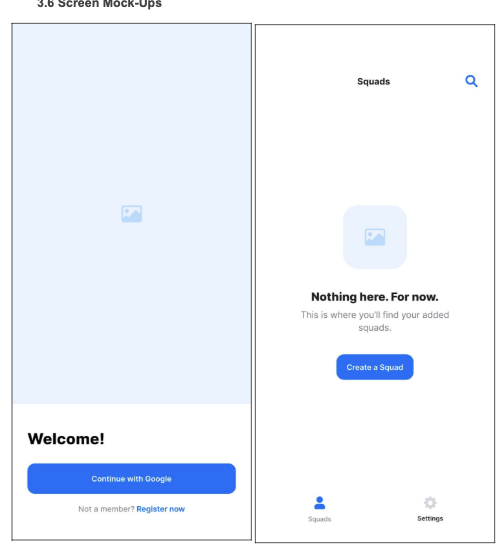
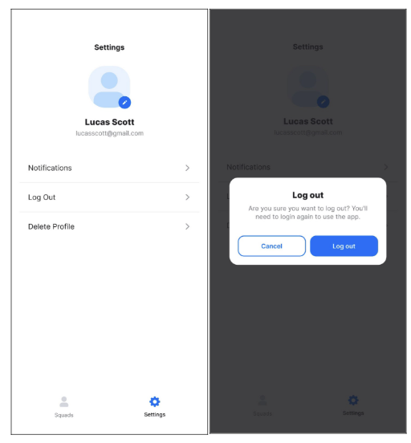
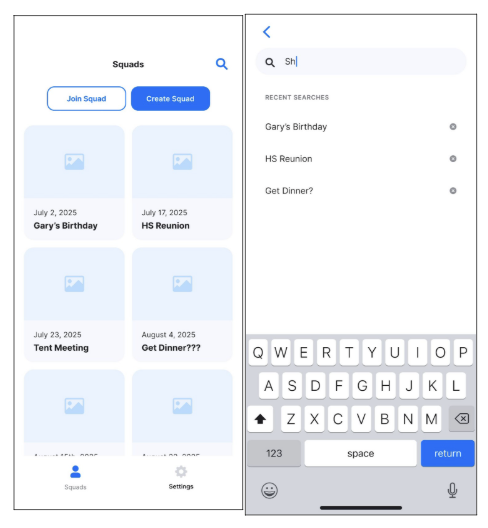
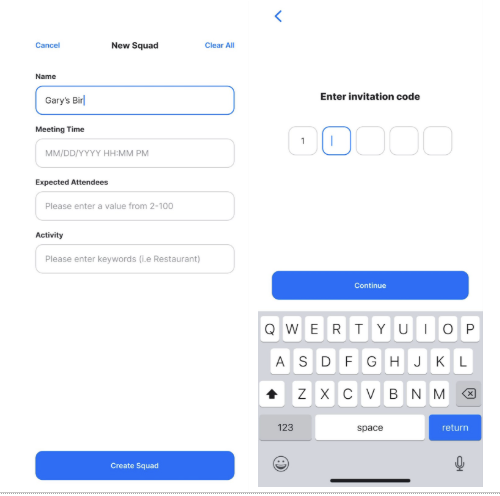
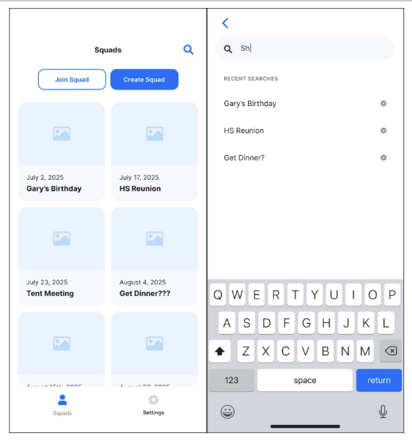
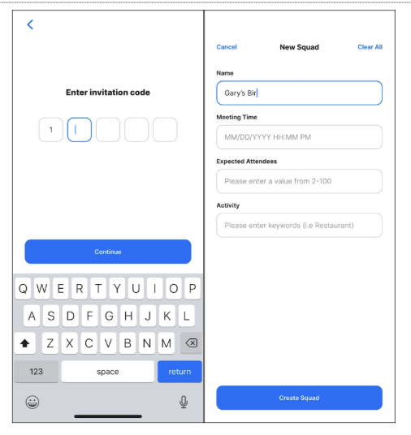
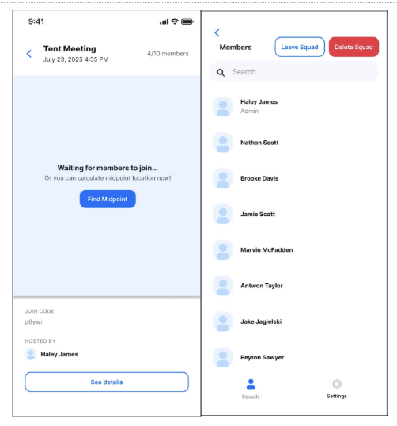
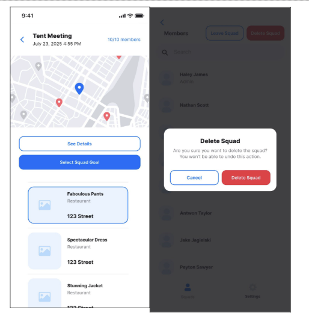

### **3.7. Non-Functional Requirements**

1. **Location Optimization Response Time**
    - **Requirement**: The system shall return location optimization results (midpoint calculation and venue suggestions) within 2 to 5 seconds of the squad leader triggering the algorithm.  
    - **Justification**: Location optimization is the core feature of SquadUp. If results take too long, users lose patience and the app fails at its main promise of simplifying group planning. Research on web/app usability shows that 31% of participants found a 2-second delay acceptable, and less than 20% tolerated a 5-second delay. Therefore, we aim for ideally 3 seconds, with a lower bound of 2 seconds and upper bound of 5 seconds. Latency also affects scalability.  
    - **Testability**: This can be validated using UI tests (measure time from button click to results rendered) and API load tests (measure server-side algorithm runtime and API latency).  

2. **Squad View Load Time**
    - **Requirement**: The system must load squad details (attendees, event time, squad status) within 2 seconds after a user selects a squad.  
    - **Justification**: Squad View is the most frequently accessed screen. Ensuring quick load maintains user engagement and supports the app’s goal of frictionless event coordination. Human–computer interaction studies suggest actions should respond within 1 second to feel fluid and keep user attention.  
    - **Testability**: This can be measured with UI performance tests (screen render time after click) and API profiling (database query and response time checks).  

#### References: 
Khiem, M., Guntur Ravindra, & Ooi, W. T. (2011). Towards understanding user tolerance to network latency in zoomable video streaming. Proceedings of the 30th ACM International Conference on Multimedia, 977–980. https://doi.org/10.1145/2072298.2071917

Nielsen, J. (1993, January 1). Response Time Limits: Article by Jakob Nielsen. Nielsen Norman Group. https://www.nngroup.com/articles/response-times-3-important-limits/

---

## 4. Designs Specification
### **4.1. Main Components**

1. **User Management Service**
    - **Purpose**: Handles user authentication, authorization, and profile CRUD (e.g., name, email, travel preferences).  
    - **Rationale**: Users persist across multiple events, so identity must be managed independently of event data. Keeping this service separate allows easy integration with third-party auth providers (Google, SSO) and ensures security boundaries are clear.  
    - **Interfaces**:  
        1. `suspend fun googleSignIn(tokenId: String): Result<AuthData>`  
            - **Purpose**: Frontend + Google Auth Service (POST) interface, returns authentication data upon sign-in success.  
        2. `suspend fun googleSignUp(tokenId: String): Result<AuthData>`  
            - **Purpose**: Frontend + Google Auth Service (POST) interface, returns authentication data upon sign-up success.  
        3. `suspend fun deleteAccount(): Result<Unit>`  
            - **Purpose**: HTTP (DELETE) interface between database + profile repository. Deletes the account of the currently logged in user.  
        4. `suspend fun getProfile(): Result<User>`  
            - **Purpose**: HTTP (GET) interface between database + profile repository. Gets the account information of the currently logged in user.  
        5. `suspend fun updateProfile(name: String, address: Address?, transitType: TransitType?): Result<User>`  
            - **Purpose**: HTTP (POST) interface between profile repository and database. Returns saved profile data upon success.  
        6. `suspend fun updateProfilePicture(profilePictureUrl: String): Result<User>`  
            - **Purpose**: HTTP (POST) interface between profile repository and database. Returns updated photo upon success.  

2. **Group Management Service**
    - **Purpose**: Provides CRUD operations for events and manages their participant lists. Since groups are single-use, event records also serve as the representation of group membership.  
    - **Rationale**: Folding group logic into event management avoids redundancy and simplifies the model. This keeps all participation and scheduling information in one place, reducing coupling and making the service easier to extend.  
    - **Interfaces**:  
        1. `suspend fun getGroups(): Result<List<GroupDataDetailed>>`  
            - **Purpose**: HTTP (GET) request to database from group repository. Returns list of all existing groups upon success.  
        2. `suspend fun createGroup(groupName: String, meetingTime: String, groupLeaderId: GroupUser, expectedPeople: Number, activityType: String): Result<GroupData>`  
            - **Purpose**: HTTP (POST) request to database from group repository. Returns group info upon success.  
        3. `suspend fun getGroupByJoinCode(joinCode: String): Result<GroupDataDetailed>`  
            - **Purpose**: HTTP (GET) with join code string as parameter. Request to database from group repository, returns corresponding group on success.  
        4. `suspend fun deleteGroupByJoinCode(joinCode:String): Result<Unit>`  
            - **Purpose**: HTTP (DELETE) with join code string as parameter. Deletes group corresponding to joinCode.  
        5. `suspend fun joinGroup(joinCode: String, expectedPeople: Number, updatedMembers: List<GroupUser>): Result<Unit>`  
            - **Purpose**: HTTP (POST) with join code and user data as body. Updates database with current user data, returns success.  
        6. `suspend fun updateGroup(joinCode: String, expectedPeople: Number?, updatedMembers: List<GroupUser>?, meetingTime: String?): Result<Unit>`  
            - **Purpose**: HTTP (POST) with join code, user data, and expected people as body. Updates database, returns success.  
        7. `suspend fun leaveGroup(joinCode: String, userId: String): Result<Unit>`  
            - **Purpose**: HTTP (POST) with join code as request parameter and user data as body. Removes corresponding user from group in database.  
        8. `suspend fun getActivities(joinCode: String): Result<List<Activity>>`  
            - **Purpose**: HTTP (GET) with join code parameter. Returns list of activities near group’s current midpoint.  
        9. `suspend fun selectActivity(joinCode: String, activity: Activity): Result<Unit>`  
            - **Purpose**: HTTP (POST) with join code and activity selection. Updates group in database with selected activity.  
        10. `suspend fun getMidpoints(joinCode: String): Result<List<LatLng>>`  
            - **Purpose**: HTTP (GET) request with join code. Returns list of potential midpoints (coordinates) from location service.  

3. **Location Optimizer**
    - **Purpose**: Calculates fair meetup spots for events by combining group members’ locations with external APIs (Google Maps for travel times).  
    - **Rationale**: Isolating the optimization logic as a dedicated service prevents the event service from becoming bloated with complex computation and API integration. It also makes it easier to swap or extend algorithms (e.g., adding a density-based or ML-driven approach later).  
    - **Interfaces**:  
        1. `suspend fun getPredictions(query: String): List<AutocompletePrediction>`  
            - **Purpose**: Queries Google Places API for autocomplete suggestions for a given location query.  
        2. `suspend fun fetchPlace(placeId: String): Address?`  
            - **Purpose**: Queries Google Places API for an address and formats it according to SquadUp’s address type.  
        3. `async getTravelTime(origin: GeoLocation, destination: GeoLocation): Promise<number>`  
            - **Purpose**: Queries Google Maps API to find travel time between an origin and destination. Used for calculating the optimal midpoint.  
        4. `suspend fun getMidpointByJoinCode(joinCode: String): Result<MidpointActivitiesResponse>`  
            - **Purpose**: HTTP (GET) with join code. Runs backend midpoint algorithm, updates group info in database, and returns midpoint.  
        5. `async getActivityList(location: GeoLocation, type: string = "restaurant", radius: number = 1000, maxResults: number = 10): Promise<Activity[]>`  
            - **Purpose**: Interface with Google Maps API to get activities near midpoint, used in `getActivities` interface for frontend.  

4. **Notification Service**
    - **Purpose**: Sends timely updates to users, including RSVP confirmations, reminders, and last-minute changes, via push notifications.  
    - **Rationale**: Running notifications as an asynchronous background service prevents delays in the main user workflow. Decoupling also allows the system to scale independently and adopt different channels without touching core event logic.  
    - **Interfaces**:  
        1. `export async function sendGroupLeaveFCM(joinCode: string, userName: string, groupName: string, actingUserId: string)`  
            - **Purpose**: Interface between Firebase Messaging and backend for users leaving a group.  
        2. `export async function sendGroupJoinFCM(joinCode: string, userName: string, groupName: string, actingUserId: string)`  
            - **Purpose**: Interface between Firebase Messaging and backend for users joining a group.  
        3. `public notifyGroupJoin(joinCode: string, userId: string, userName: string, groupName: string)`  
            - **Purpose**: Interface between Firebase Messaging and WebSocket service to notify users of group join events.  
        4. `public notifyGroupUpdate(joinCode: string, message: string, data?: any)`  
            - **Purpose**: Interface between Firebase Messaging and WebSocket service to notify users of group updates (e.g., midpoint changes).  
        5. `public notifyGroupLeave(joinCode: string, userId: string, userName: string, groupName: string)`  
            - **Purpose**: Interface between Firebase Messaging and WebSocket service to notify users when a member leaves a group.  

### **4.2. Databases**
1. **MongoDB**
    - **Purpose**: Storage of all user and group information.
    - **Reasoning**: We decided to choose a NoSQL database that stores events, squads and user data in flexible JSON-like documents. MongoDB was selected over relational databases because SquadUp’s data structures are semi-structured and expected to evolve such as new event preferences or squad features 

### **4.3. External Modules**
1. **Google Maps API** 
    - **Purpose**: Midpoint calculations, travel times and venue suggestions.
2. **Google Authentication** 
    - **Purpose**: Secure user login.
3. **Firebase Cloud Messaging** 
    - **Purpose**: Reliable and scalable infrastructure for sending real-time notifications to users on Android.

### **4.4. Frameworks and Libraries**

#### Backend Frameworks, Libraries, and Infrastructure

1. **AWS (Amazon Web Services)**  
   Reasons: Chosen for scalable hosting, managed databases, and cost-effectiveness. The free tier covers our needs as long as we don’t exceed one instance, and AWS provides reliable infrastructure for backend services.

2. **Node.js with Express.js + TypeScript**  
   Reasons: TypeScript improves reliability with static typing, while Express provides a flexible API layer. This combination enables scalable and maintainable backend development.

3. **MongoDB with Mongoose**  
   Reasons: Mongoose simplifies schema design and enforces structure for MongoDB, making data management reliable and maintainable.

4. **Firebase Admin SDK**  
   Reasons: Provides server-side Firebase functionality for authentication and database management, integrating seamlessly with our backend.

5. **Axios**  
   Reasons: A promise-based HTTP client for making API requests to external services, ensuring efficient and reliable communication.

6. **Retrofit**  
   Reasons: Used in Kotlin/Java modules to simplify REST API calls, JSON parsing, and logging.

7. **jsonwebtoken**  
   Reasons: For creating and verifying JWT tokens, supporting secure user authentication.

8. **Multer**  
   Reasons: Middleware for handling file uploads in Express.

9. **ws (WebSockets)**  
   Reasons: Enables real-time, full-duplex communication between clients and the server, supporting features like live messaging.

10. **Zod**  
    Reasons: Validates incoming API requests with type-safe schemas, improving backend security and reliability.

11. **@googlemaps/google-maps-services-js**  
    Reasons: Provides a client library to access Google Maps APIs for location-based features.

12. **dotenv / dotenv-cli**  
    Reasons: Manages environment variables in development and production, simplifying configuration and security.

13. **Development Tools: TypeScript / ts-node / nodemon / Prettier**  
    Reasons: Improves code reliability, enables running TypeScript without manual compilation, auto-restarts server on changes, and ensures consistent code formatting.

#### Frontend & Android Frameworks

1. **Core Android & Kotlin**  
   androidx.core:ktx, androidx.lifecycle:runtime-ktx, androidx.activity:compose  
   Reasons: Simplify Android development with Kotlin, improve code readability, and provide lifecycle-aware components for reliable app behavior.

2. **Jetpack Compose**  
   androidx.compose.ui / graphics / tooling.preview, androidx.compose.material3, androidx.compose.material.icons.extended, androidx.compose.foundation / foundation.layout, androidx.navigation:compose, androidx.lifecycle.viewmodel.compose  
   Reasons: Provides a modern, declarative UI toolkit, enabling faster development and easier maintenance of responsive Android interfaces.

3. **Dependency Injection - Hilt**  
   Reasons: Simplifies dependency injection for Android, improving modularity, testability, and maintainability.

4. **Google & Firebase Services**  
   Firebase Messaging, Google Play Services Auth / googleid / androidx.credentials, Places API / Maps Compose / Maps Utils  
   Reasons: Offers scalable, reliable, and easy-to-integrate authentication, notifications, and location services.

5. **Networking**  
   Retrofit / converter-gson / logging-interceptor  
   Reasons: Simplifies API calls, JSON parsing, and request logging, improving networking reliability in Android.

6. **Image Loading - Coil Compose**  
   Reasons: Efficient asynchronous image loading for responsive UI in Compose.

7. **Concurrency & Data Storage**  
   kotlinx.coroutines.android / kotlinx.coroutines.play.services, androidx.datastore.preferences  
   Reasons: Supports smooth asynchronous operations and modern data storage, ensuring responsive and maintainable app behavior.

8. **Material & UI - libs.material**  
   Reasons: Provides consistent Material Design styling for a polished user interface.

9. **Testing**  
   JUnit / androidx.junit / Espresso / Compose UI testing libraries, Compose UI tooling / test manifest  
   Reasons: Ensures app correctness, UI reliability, and maintainability through automated testing.

### **4.5. Dependencies Diagram**

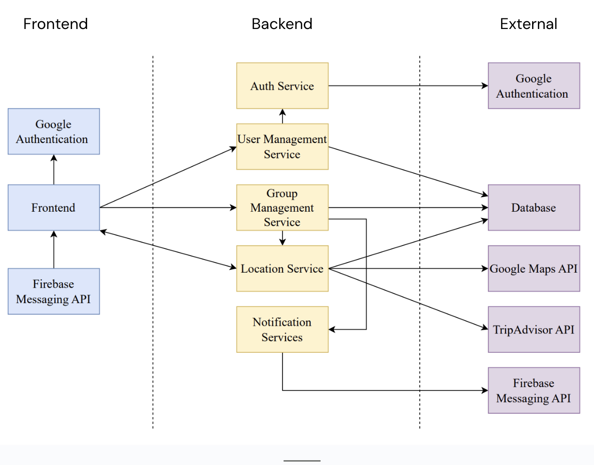

### **4.6. Use Case Sequence Diagram (5 Most Major Use Cases)**
1. [**[Create Group]**](#uc1)\
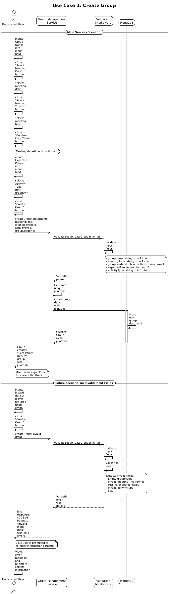
1. [**[Join Group]**](#uc1)\
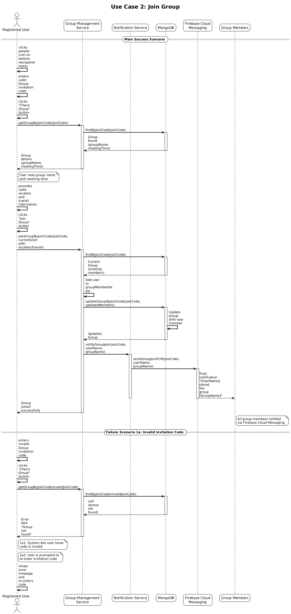
1. [**[View Specific Group]**](#uc1)\
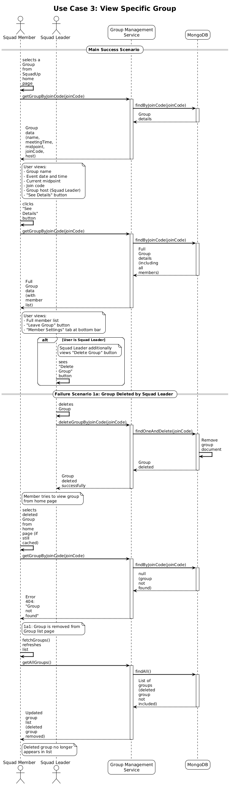
1. [**[Find Midpoint]**](#uc1)\
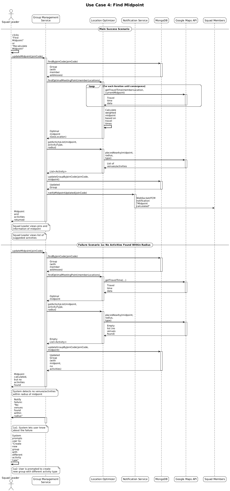
1. [**[Select Activity]**](#uc1)\
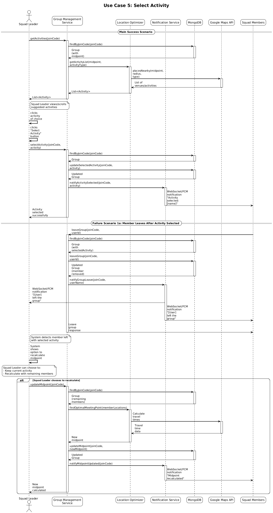

### **4.7. Design and Ways to Test Non-Functional Requirements**

1. [**Location Optimization Response Time**](#nfr1)  
    - **Validation**: The location optimization algorithm uses parallel API calls with `Promise.all()` to fetch travel times concurrently from Google Maps Distance Matrix API during each iteration, reducing total network latency from sequential to concurrent execution. Early convergence detection (epsilon threshold check) and a maximum of 20 iterations are enforced. Previously calculated midpoints are cached in the database for instant return if the group configuration hasn't changed. The initial geographic midpoint calculation is performed in-memory without external API calls, providing a fast starting point for iterative refinement.

2. [**Group View Load Time**](#nfr2)  
    - **Validation**: The Group View uses a single indexed database query on the `joinCode` field (MongoDB index on line 37 of `group.model.ts`) to fetch all group details including attendees, event time, and status in one atomic operation via `findByJoinCode()`, avoiding multiple round trips and ensuring sub-second database response times. The query leverages MongoDB's indexed `findOne()` operation which provides O(log n) lookup performance, and the API endpoint returns the complete group document with all nested member information pre-populated, eliminating the need for additional join queries or data fetching.
