# Testing and Code Review

## 1. Change History

| **Change Date**   | **Modified Sections** | **Rationale** |
| ----------------- | --------------------- | ------------- |
| _Nothing to show_ |

---

## 2. Back-end Test Specification: APIs

### 2.1. Locations of Back-end Tests and Instructions to Run Them

| **Interface**                      | **Describe Group Location, No Mocks**     | **Describe Group Location, With Mocks**            | **Mocked Components**     |
| ---------------------------------- | ----------------------------------------- | -------------------------------------------------- | ------------------------- |
| **POST /auth/signup**              | N/A                                       | `tests/mocked/auth.controller.mocked.test.ts#L31`  | Authentication Service    |
| **POST /auth/signin**              | N/A                                       | `tests/mocked/auth.controller.mocked.test.ts#L146` | Authentication Service    |
| **GET /user/profile**              | `tests/unmocked/user.tests.ts#L276`       | N/A                                                | Authentication Service    |
| **POST /user/profile**             | `tests/unmocked/user.tests.ts#L100`       | `tests/mocked/user.mocked.test.ts#L54`             | MongoDB, Media Service    |
| **DELETE /user/profile**           | `tests/unmocked/user.tests.ts#L134`       | `tests/mocked/user.mocked.test.ts#L145`            | MongoDB, Media Service    |
| **POST /group/create**             | `tests/unmocked/group.tests.ts#L476`      | `tests/mocked/group.mocked.test.ts#L169`           | MongoDB                   |
| **GET /group/info**                | `tests/unmocked/group.tests.ts#L429`      | `tests/unmocked/group.tests.ts#L49`                | MongoDB                   |
| **GET /group/:joinCode**           | `tests/unmocked/group.tests.ts#L443`      | `tests/unmocked/group.tests.ts#L77`                | MongoDB                   |
| **POST /group/update**             | `tests/unmocked/group.tests.ts#L555`      | N/A                                                | MongoDB                   |
| **DELETE /group/delete/:joinCode** | `tests/unmocked/group.tests.ts#L598`      | `tests/unmocked/group.tests.ts#L198`               | MongoDB                   |
| **POST /group/join**               | `tests/unmocked/group.tests.ts#L443`      | `tests/unmocked/group.tests.ts#L77`                | MongoDB                   |
| **POST /group/leave/:joinCode**    | `tests/unmocked/group.tests.ts#L506`      | `tests/unmocked/group.tests.ts#L102`               | MongoDB                   |
| **GET /group/activities**          | `tests/unmocked/activities.tests.ts#L144` | `tests/mocked/activities.mocked.test.ts#L29`       | MongoDB, Location Service |
| **POST /group/activities/select**  | `tests/unmocked/activities.tests.ts#L224` | `tests/mocked/activities.mocked.test.ts#L92`       | MongoDB, Location Service |


#### 2.1.2. Commit Hash Where Tests Run

`[Insert Commit SHA here]`

#### 2.1.3. Explanation on How to Run the Tests

1. **Clone the Repository**:

2. **Install Required Libraries**:

   - Ensure the following libraries are installed:

   ```npm install --save-dev jest``` \
   ```npm install --save-dev ts-jest``` \
   ```npm install --save-dev @types/jest```

3. **Navigate to the Back-end Directory**:

   ```cd backend```

4. **Run the Tests**:

   ```npx jest```

5. **Run the Tests with Coverage Report**:

   ```npx jest --coverage```

### 2.2. GitHub Actions Configuration Location

`~/.github/workflows/backend-tests.yml`

### 2.3. Jest Coverage Report Screenshots for Tests Without Mocking

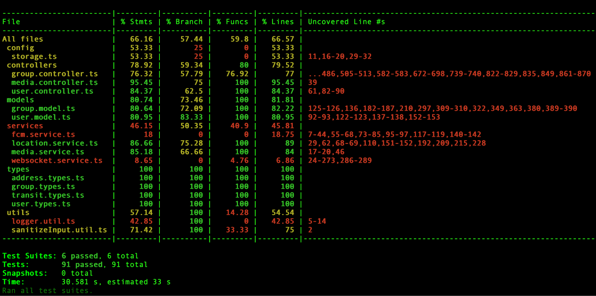

### 2.4. Jest Coverage Report Screenshots for Tests With Mocking

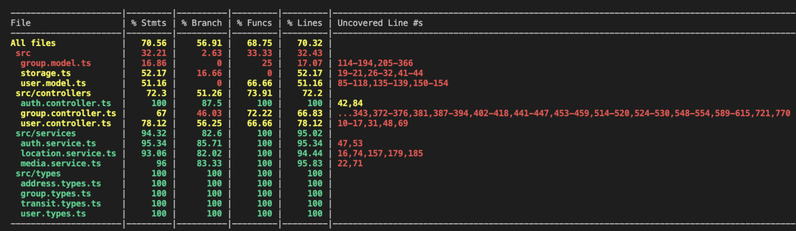

### 2.5. Jest Coverage Report Screenshots for Both Tests With and Without Mocking

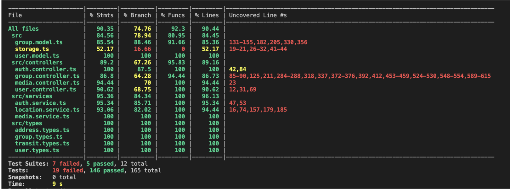

---

## 3. Back-end Test Specification: Tests of Non-Functional Requirements

### 3.1. Test Locations in Git

| **Non-Functional Requirement**  | **Location in Git**                              |
| ------------------------------- | ------------------------------------------------ |
| **Location Service**            | tests/nonfunctional.test.ts#18                  |
| **Group View Load Time**        | tests/nonfunctional.test.ts#297                 |

### 3.2. Explanation of Non-Functional Requirement Tests

**Location Service**:

These tests measure the performance of the location optimization algorithm to ensure it meets the non-functional requirement of returning results within 2-5 seconds. The tests calculate midpoints for groups of varying sizes (2, 5, and 10 users) and also measure the combined response time when fetching both the optimal meeting point AND retrieving nearby activities/venues. By testing with different group sizes, the tests verify that the algorithm scales reasonably and doesn't degrade significantly as more users are added to the calculation.

**Group View Load Time**:

These tests measure the API response time for fetching group information to ensure it meets the requirement of loading group details within 2 seconds. The tests simulate various scenarios including fetching a single group by join code (with different member counts), fetching all groups at once, and calculating midpoints. By testing with different group member counts, these tests verify that the database queries and data serialization don't cause performance degradation, ensuring the UI can display group information to users quickly regardless of group size.


### 3.2. Test Verification and Logs

- **Location Service**

  - **Verification:** The location optimization service consistently calculates optimal meeting points for groups of 2, 5, and 10 users within the 5-second requirement. Tests verify that midpoint calculations and activity list retrieval (combined operations) complete within acceptable timeframes across all tested group sizes, demonstrating that the algorithm scales efficiently without performance degradation.
  - **Log Output**
    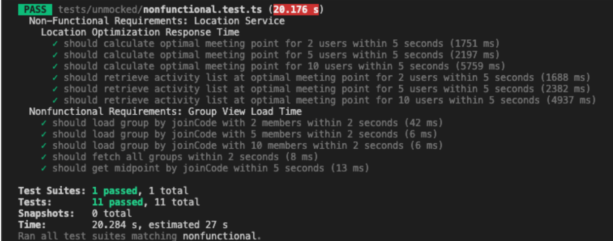

- **Group View Load Time**
  - **Verification:** Group view endpoints meet the 2-second response time requirement for fetching group details regardless of member count (2, 5, or 10 members). The `getAllGroups` endpoint also completes within 2 seconds when fetching multiple groups, and the midpoint calculation endpoint stays within the 5-second threshold, confirming that database queries and data serialization do not cause performance bottlenecks.
  - **Log Output**

    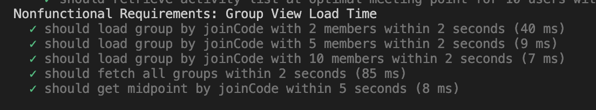
---

## 4. Front-end Test Specification

### 4.1. Location in Git of Front-end Test Suite:

`frontend/app/src/androidTest/java/com/cpen321/squadup`

### 4.2. Tests

> When we say "User," it refers to a registered user, including both Squad Leader and Squad Member.  
> **Prerequisites:** User is authenticated, groups exist, at least one group has midpoint calculated and an activity selected.

---

### Feature: Group Management

#### Use Case: Create Group

**Expected Behaviours:**

| **Scenario Steps** | **Test Case Steps** |
| ----------------- | ------------------ |
| User inputs the Group Name into the input field. | Check that the "Group Name" input field is present on screen. Input "Weekend Hangout" in the "Group Name" field. |
| User selects meeting date from the "Select Meeting Date" button. | Click the button labelled "Select Meeting Date". Check that the date picker dialog is opened. Click "OK" in the date picker dialog. |
| User selects meeting time from the "Select Meeting Time" button. | Click the button labelled "Select Meeting Time". Check that the time picker dialog is opened. Click "OK" in the time picker dialog. |
| User clicks "Confirm Date-Time" button. | Click the button labelled "Confirm Date-Time". |
| User inputs Expected People into the input field. | Check that the "Expected People" input field is present. Input "5" in the field. |
| User selects Activity Type from the dropdown field. | Click "Select Activity Type". Check that the dropdown menu is displayed. Click "RESTAURANT" from the options. |
| User clicks "Create Group" button. | Check that the button with testTag "createGroupButton" is displayed and enabled. Click the "Create Group" button. |
| 1a. Input fields are invalid | Click "Create Group" button without filling required fields. Check that a dialog prompts user to confirm date and time. |
| 1a1. User re-enters correct information | Verify error message is displayed. Re-enter valid information. |

**Test Logs:**

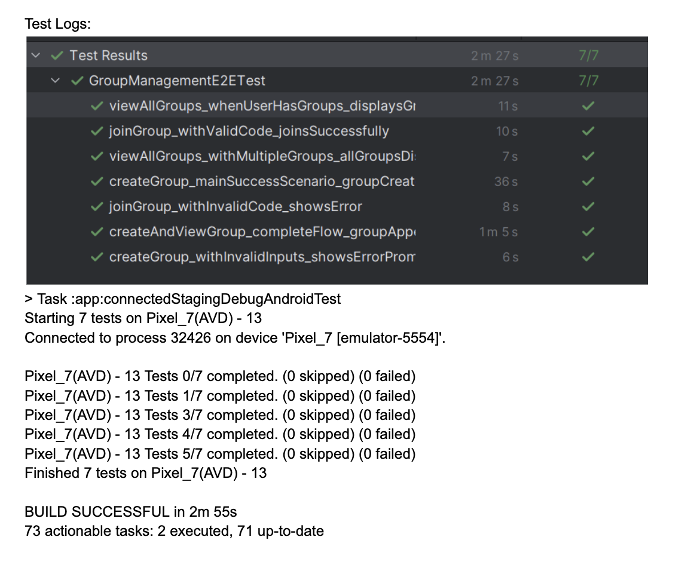

---

#### Use Case: Join Group

**Expected Behaviours:**

| **Scenario Steps** | **Test Case Steps** |
| ----------------- | ------------------ |
| User clicks the people icon on the bottom navigation menu. | Click icon button "Join Group". Check that "Join Group" screen is displayed. |
| User enters a valid Group invitation code. | Check "Enter Join Code" field is present. Input "ABC123". |
| User clicks "Check Group" button. | Click "Check Group" button. Wait for API response (2000ms). |
| User provides location and transit info. | Check location fields. Input valid address and select transit type. |
| User clicks "Join Group". | Click "Join Group" button. |
| User is notified of successful join. | Verify navigation occurs or success message is displayed. |
| 1a. Invalid invitation code | Input invalid code (e.g., "XXXXXX") and click "Check Group". |
| 1a1. Error message displayed | Check error message indicating code is invalid. |
| 1a2. User re-enters code | Verify "Enter Join Code" field is accessible. |

**Test Logs:**

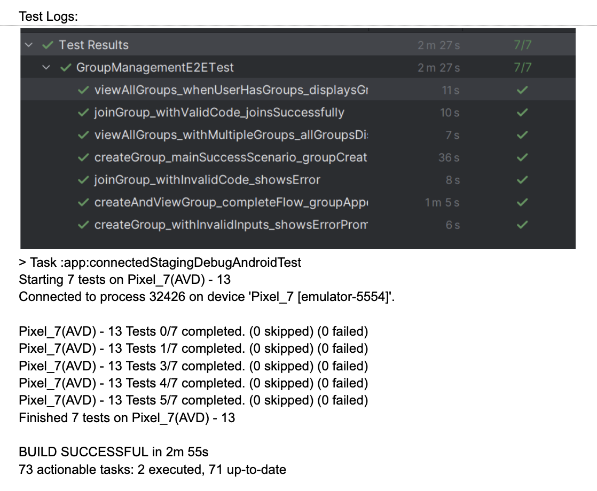

#### Use Case: View All Groups

| **Scenario Steps** | **Test Case Steps** |
| ----------------- | ------------------ |
| 1. User opens SquadUp home page. | Wait for main screen to load (2000ms). |
| 2. User views overview list of all groups. | Check "Create Group" and "Join Group" buttons are displayed. Verify group buttons with testTag "groupButton" if groups exist. |
| 3. User has multiple groups. | Wait for groups to load. Verify multiple group buttons display name and leader info. |

**Test Logs:**

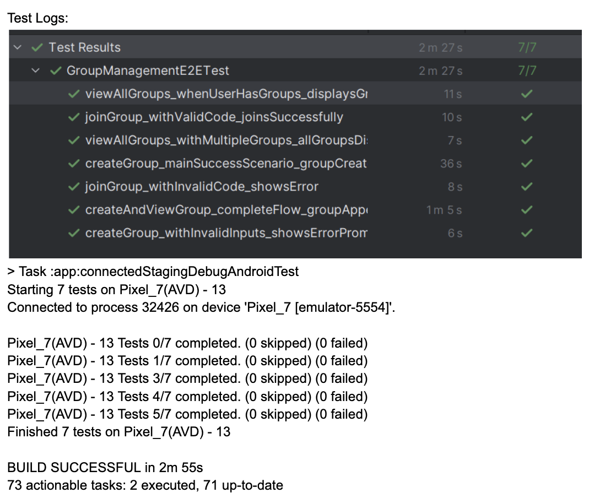

---

#### Use Case: View Specific Group

| **Scenario Steps** | **Test Case Steps** |
| ----------------- | ------------------ |
| User selects a group. | Wait for main screen to load. Click on group button with testTag "groupButton". |
| User views group details. | Check "Join Code," "Host," "Members," and "See Details" button displayed. Verify back button is present. |
| User clicks "See Details". | Click "See Details" button. |
| User views full member list and bottom bar tabs. | Check "Members," "Leave Squad," "Squads," and "Settings" buttons displayed. |
| User is Squad Leader. | Verify "Delete Squad" button is displayed. |
| 1a. Group deleted by Squad Leader. | Click "See Details," "Delete Squad," wait 2000ms. |
| 1a1. Group removed from list. | Navigate back. Verify deleted group no longer appears. Check "Create Group" and "Join Group" buttons displayed. |

**Test Logs:**


---

#### Use Case: Leave Group

| **Scenario Steps** | **Test Case Steps** |
| ----------------- | ------------------ |
| 1. Navigate to a group. | Wait for main screen to load. Click on group button. |
| 2. Click "See Details". | Click button labelled "See Details". |
| 3. View member list. | Check "Members" and "Leave Squad" buttons displayed. |
| 4. Click "Leave Squad". | Click button labelled "Leave Squad". Wait 2000ms. |
| 5. User navigated back. | Check "Create Group" button displayed. Verify group no longer in list. |

**Test Logs:**

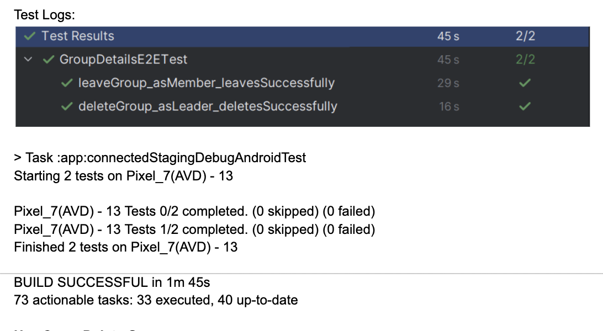

---

#### Use Case: Delete Group

| **Scenario Steps** | **Test Case Steps** |
| ----------------- | ------------------ |
| 1. Squad Leader navigates to group. | Wait for main screen to load. Click group button with testTag "groupButton". |
| 2. Click "See Details". | Wait 1500ms. Click "See Details". |
| 3. Verify "Delete Squad" button. | Wait 1000ms. Check "Members" and "Delete Squad" buttons displayed. |
| 4. Click "Delete Squad". | Click "Delete Squad" button. |
| 5. Group deleted. | Wait 2000ms. Verify "Create Group" and "Join Group" buttons displayed. |
| 6. Group removed from list. | Verify deleted group no longer appears. |

**Test Logs:**

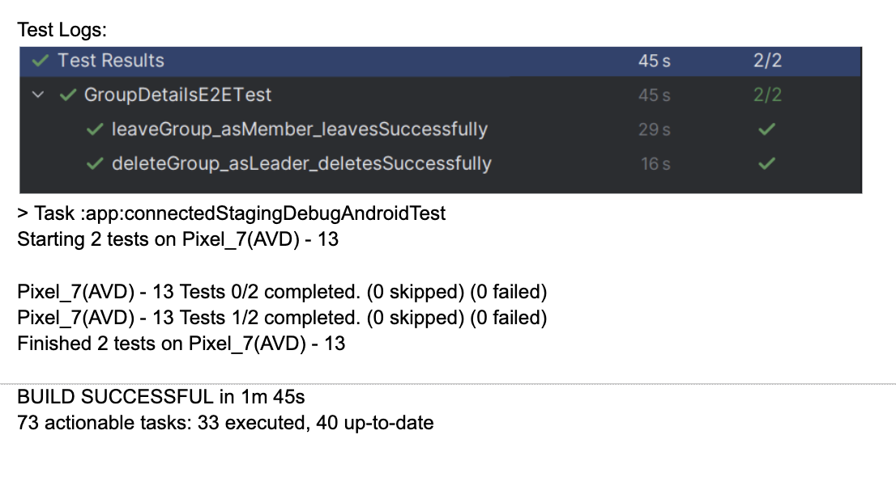

## Feature: Group View

### Use Case: View Event Time

| **Scenario Steps** | **Test Case Steps** |
| ----------------- | ------------------ |
| 1. User navigates to a group. | Wait for main screen to load. Click on a group button with testTag "groupButton". |
| 2. User views event time in group details screen. | Check element with testTag "groupMeetingTime" is displayed. Verify back button is present. |
| 3. User navigates between different views. | Click "See Details" button. Verify "Members" screen displayed. Press back button. Check "groupMeetingTime" still displayed. |

**Test Logs:**  
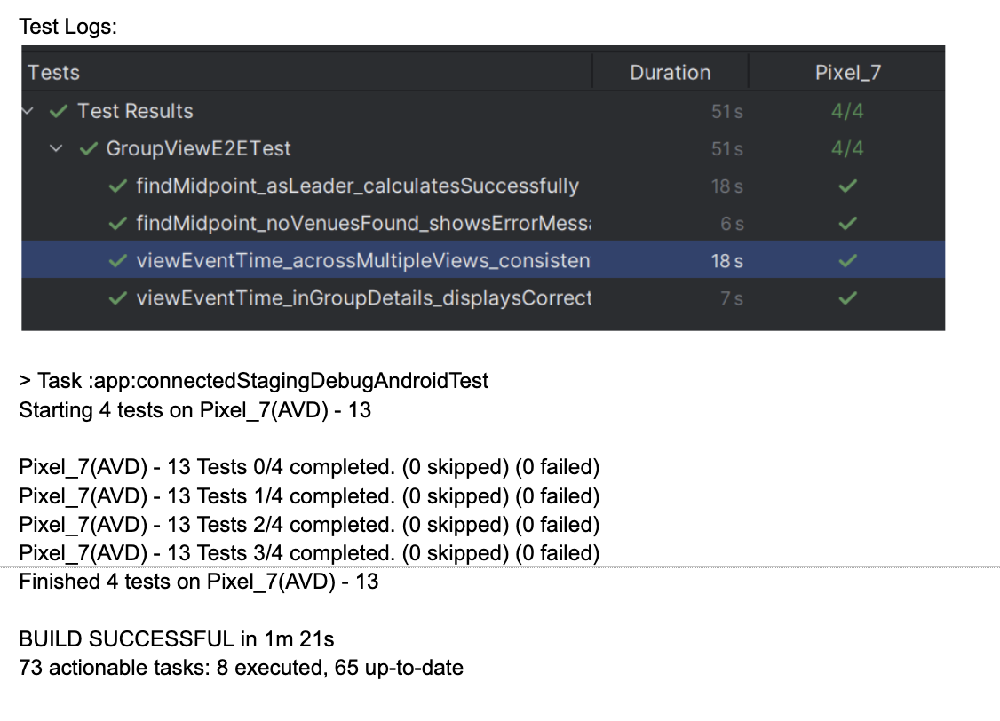

---

### Use Case: View Current Midpoint

| **Scenario Steps** | **Test Case Steps** |
| ----------------- | ------------------ |
| 1. Squad Leader clicks "Find Midpoint" or "Recalculate Midpoint". | Navigate to a group where user is leader. Wait for group details to load. Click appropriate button. |
| 2. Squad Leader views midpoint pins and suggested activities. | Wait 5000ms for calculation. Check map view and activity cards with testTag "activityCard". Verify "Join Code" section still displayed. |
| 1a. Midpoint fails to fetch venues/activities. | Click "Find midpoint". Wait for "Getting midpoint..." message. Wait 5000ms. |
| 1a1. Notify user of failure. | Check text "No activities found within the radius..." is displayed. |
| 1a2. Prompt user to create new group/activity type. | Verify error message suggests creating a new group. User can navigate back or create a new group. |

**Test Logs:**  
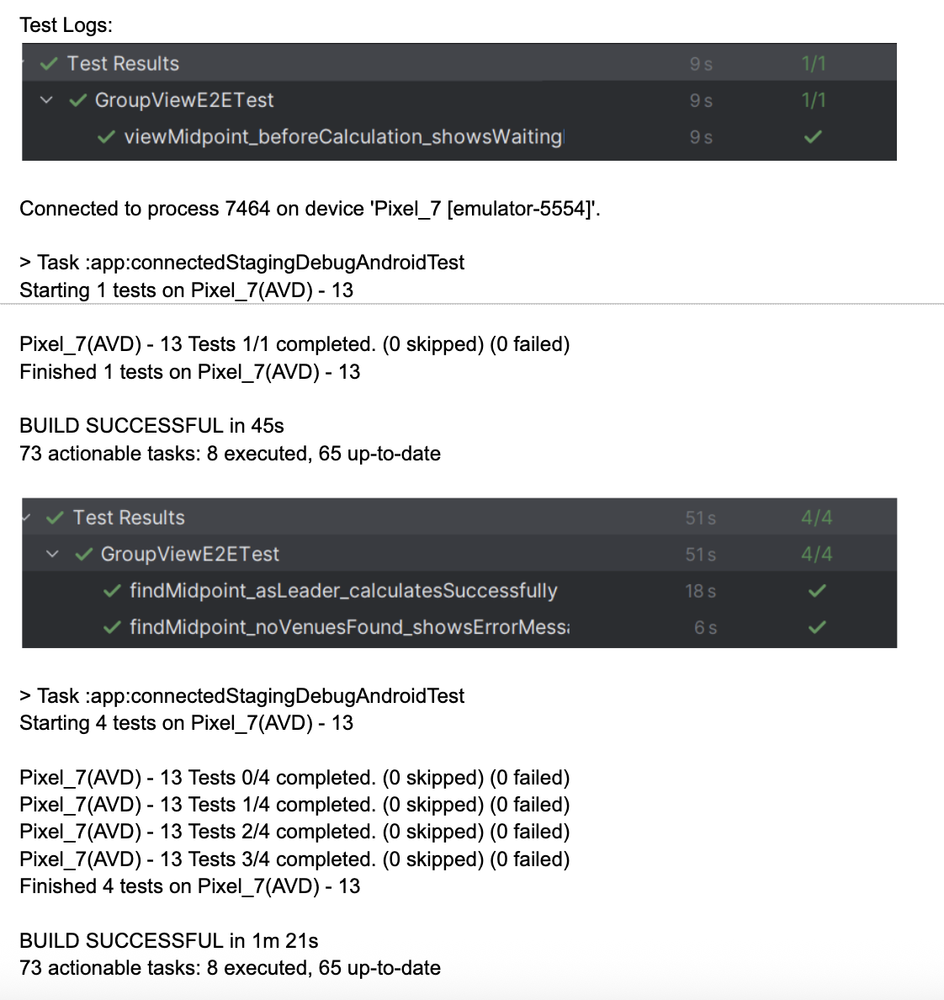

---

### Use Case: View Attendees

| **Scenario Steps** | **Test Case Steps** |
| ----------------- | ------------------ |
| User opens a group on the main screen. | Open group. Check "See Details" button is present. Click button. |
| User views member list. | Check at least one member is visible. |

**Test Logs:**  
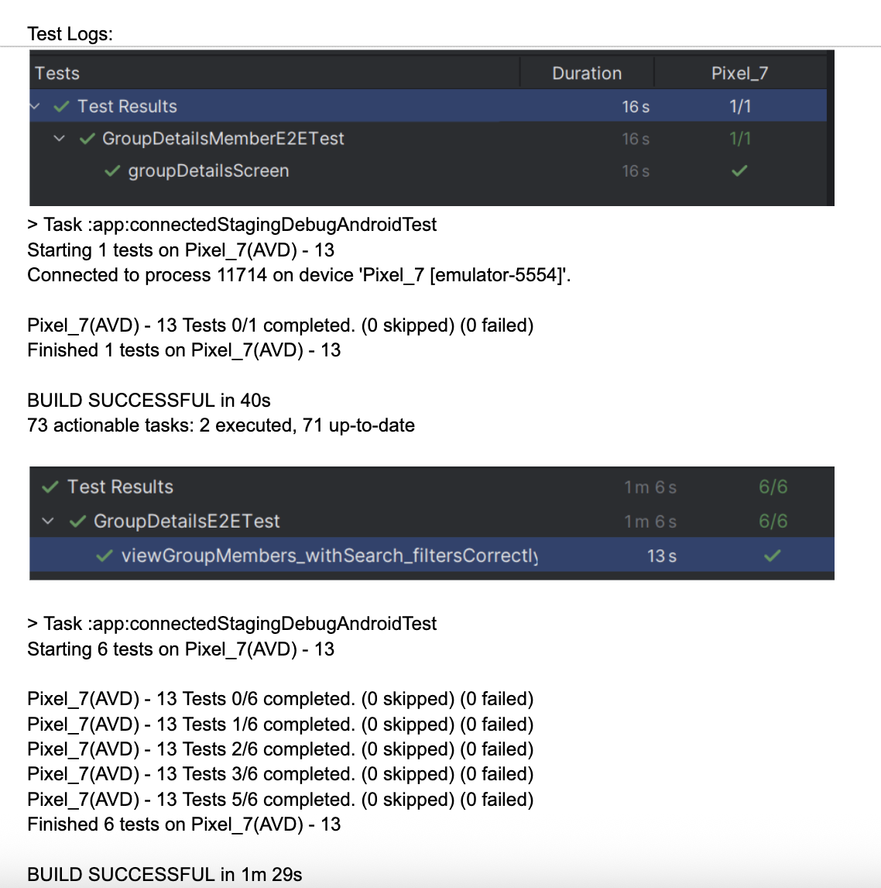

---

### Use Case: View Selected Activity

| **Scenario Steps** | **Test Case Steps** |
| ----------------- | ------------------ |
| Squad Member opens a group. | Open a group they are a member of. |
| User sees map with location pins and selected activity card. | Check activity box is present and loaded. Check activity is displayed and not empty. |

**Test Logs:**  
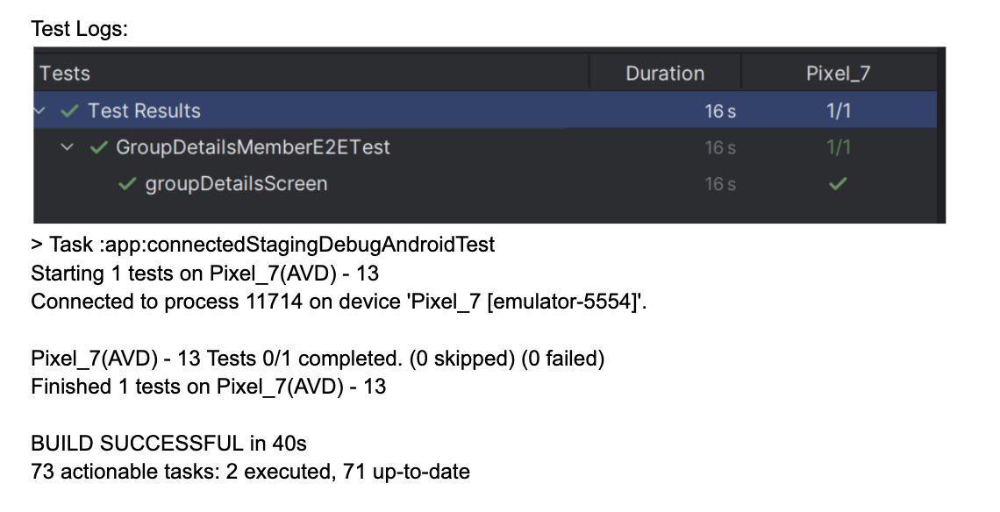

---

### Use Case: View Recommended Locations

| **Scenario Steps** | **Test Case Steps** |
| ----------------- | ------------------ |
| Squad Leader opens a group. | Open their group on the main screen. |
| User sees map with recommended activities list. | Check node with tag "ActivityPicker" or activities list is present and loaded. |

**Test Logs:**  
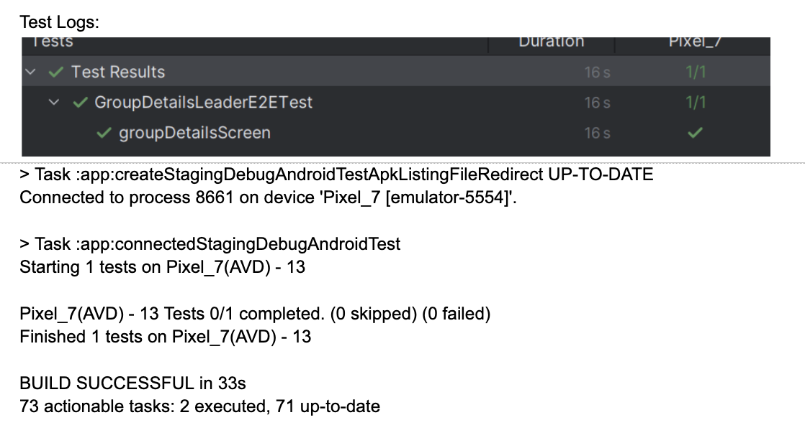


## Feature: Update Group


### Use Case: Update Expected People

**Expected Behaviours:**

| **Scenario Steps** | **Test Case Steps** |
| ----------------- | ------------------ |
| Squad Leader clicks and opens their group on the main screen. | Open their group on the main screen. |
| The app shows Group Details Screen which has a “See Details” button. The button is enabled and the Squad Leader clicks the button. | Check that the button is present on screen. Click the button “See Details”. |
| The app shows the screen with a navigation bar at the bottom of the screen with two items. The Squad Leader clicks the “Settings” option. | Check that the navigation bar item is present on screen. Click the option. |
| 4a. Squad Leader input invalid string of numbers (e.g., 0) for “Expected People” then click the “Save” button. | Input “0” into the “Expected People” text field. Check that button is present on screen. Click the button. |
| 4a1. The app displays an error message prompting the user for the expected format. | Check that a dialog is opened with the message “Expected people must be a positive number.” |
| The Squad Leader inputs a valid string of number for “Expected People”  (e.g., 7) and clicks “Save” button | Input “7” into the “Expected People” text field. Check that button is present on screen. Click the button. |
| The app confirms action success | Check that a dialog is opened with the message “Settings saved successfully!”. |

**Test Logs:**  
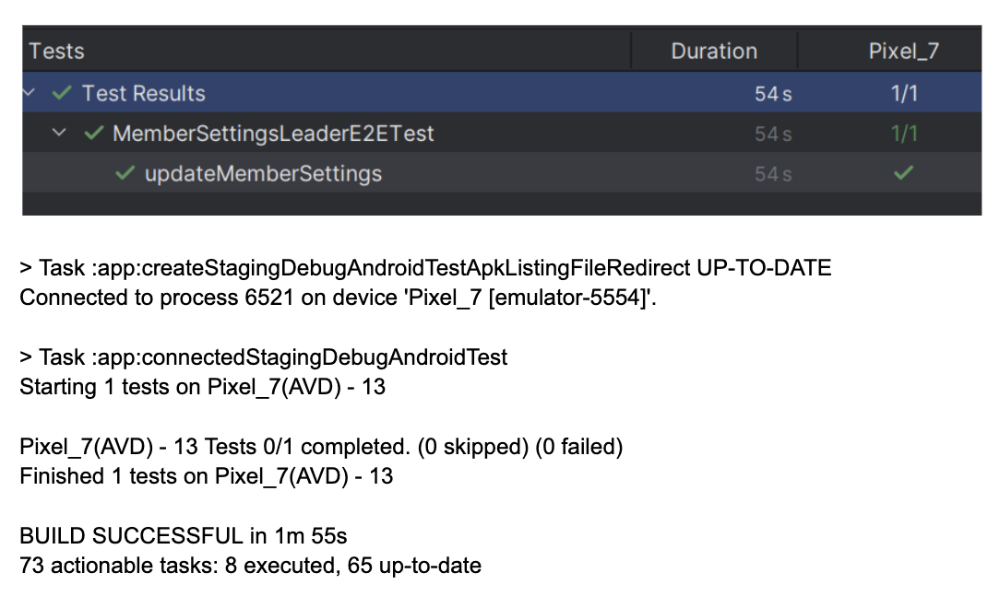

---

### Use Case: Update Event Time

**Expected Behaviours:**

| **Scenario Steps** | **Test Case Steps** |
| ----------------- | ------------------ |
| Squad Leader clicks and opens their group on the main screen. | Open their group on the main screen. |
| Click “See Details” button. | Check that the button is present. Click it. |
| Click “Settings” option in navigation bar. | Check that the navigation bar item is present. Click it. |
| Click “Click to update Meeting Date & Time” button. | Check button is present. Click button. |
| 5a. Squad Leader selects a past date/time | Click “OK” twice to set current date/time. |
| 5a1. App displays an error | Check that a dialog is opened with the message “Meeting time must be in the future.” |
| 5b. Squad Leader selects a future date/time and clicks “Save” | Use DatePicker to choose next day. Click “OK”. Click “Save”. |
| App confirms action success | Check that a dialog is opened with the message “Settings saved successfully!”. |

**Test Logs:**  
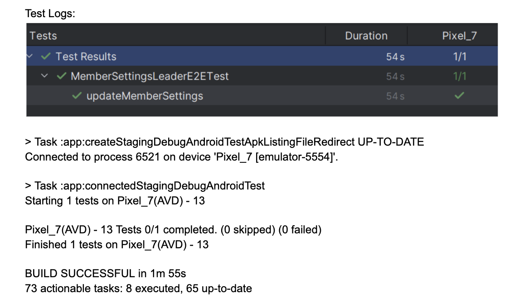

---

### Use Case: Update Member Address

**Expected Behaviours:**

| **Scenario Steps** | **Test Case Steps** |
| ----------------- | ------------------ |
| User opens group and clicks “See Details”. | Open group. Click “See Details” button. |
| Click “Settings” option. | Check that navigation bar item is present. Click option. |
| 5a. User inputs invalid address or does not choose from dropdown, clicks “Save” | Input “Some random text” into address field. Check button present. Click “Save”. |
| 5a1. App displays error | Check dialog shows “Please select a valid address.” |
| 5b. User inputs valid address and selects suggestion, clicks “Save” | Input “6445 University Boulevard, Vancouver, BC” and select first suggestion. Click “Save”. |
| App confirms action success | Check that a dialog is opened with “Settings saved successfully!”. |

**Test Logs:**  
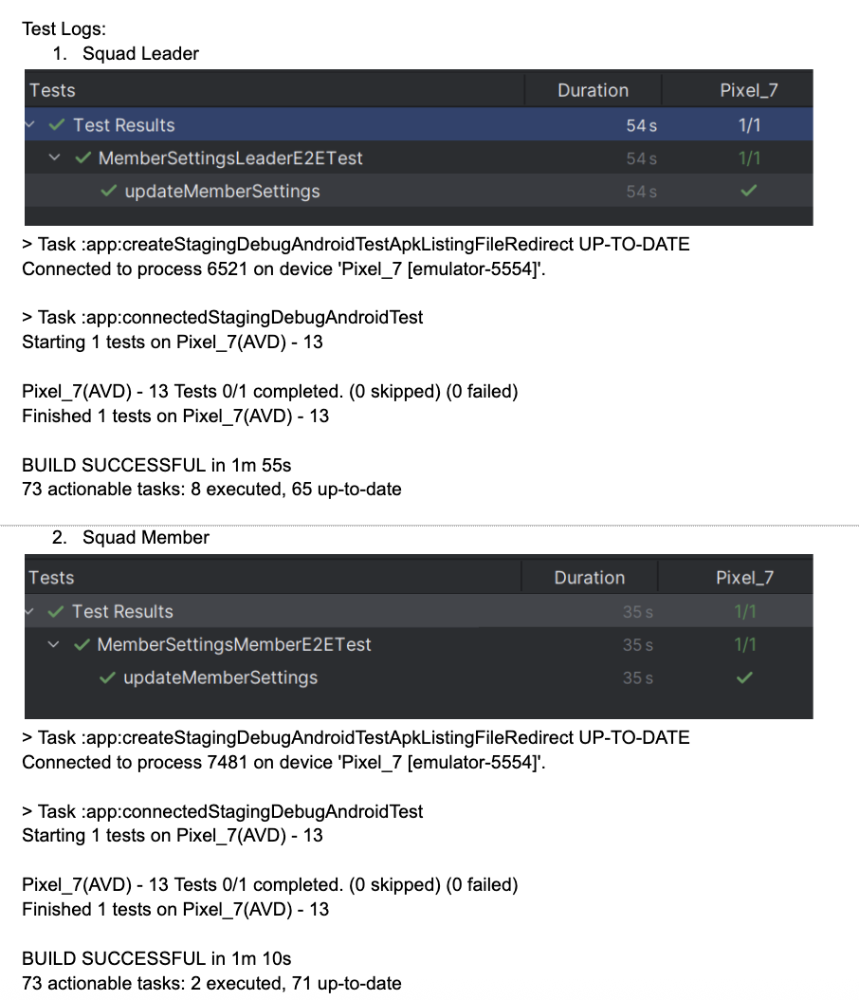

---

### Use Case: Update Member Transit

**Expected Behaviours:**

| **Scenario Steps** | **Test Case Steps** |
| ----------------- | ------------------ |
| User opens group and clicks “See Details”. | Open group. Click “See Details” button. |
| Click “Settings” option. | Check navigation bar item present. Click option. |
| Click “Preferred Mode of Transport” text field | Check field is present. Click field. |
| Select option and click “Save” | Choose “DRIVING”. Click “Save”. |
| App confirms action success | Check dialog shows “Settings saved successfully!”. |

**Test Logs:**  
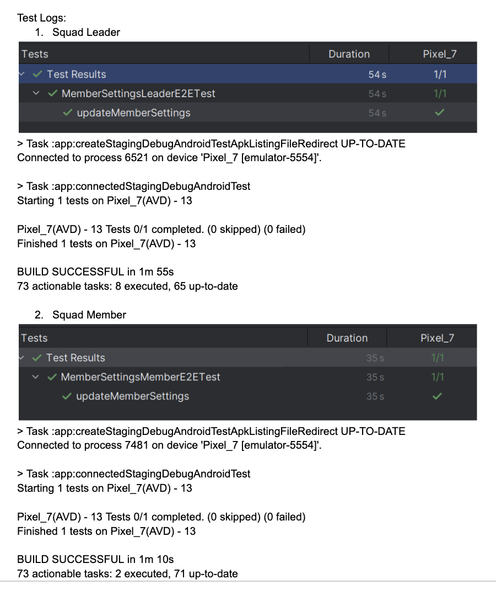

---

### Use Case: Find Midpoint

**Expected Behaviours:**

| **Scenario Steps** | **Test Case Steps** |
| ----------------- | ------------------ |
| Squad Leader opens group | Open group on main screen. |
| Click “Find Midpoint” or “Recalculate Midpoint” | Check button is present. Click button. |
| App calculates midpoint | Check text box shows “Getting midpoint…”. Wait for it to disappear. |
| Screen updates with map and pins | Check map appears with location pins. |

**Test Logs:**  


---

### Use Case: Select Activity

**Expected Behaviours:**

| **Scenario Steps** | **Test Case Steps** |
| ----------------- | ------------------ |
| Squad Leader opens group | Open group on main screen. |
| Midpoint calculated; view recommended activities | Check "ActivityPicker" present and loaded. |
| Select an activity | Select first item in the list. |
| Confirm selection | Check “Select Activity” button present. Click button. |
| App confirms action success | Check dialog shows “Activity selected successfully!”. |

**Test Logs:**  
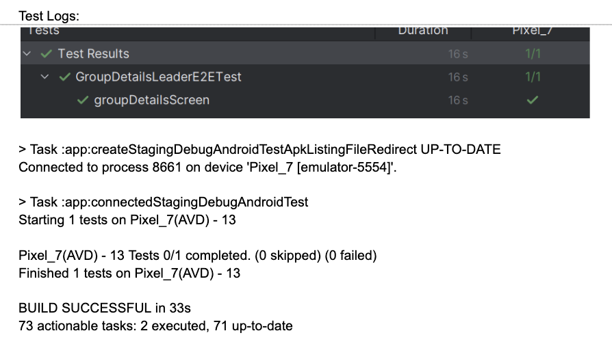


---

## 5. Automated Code Review Results

### 5.1. Commit Hash Where Codacy Ran

`6daeda88bd9b2733c550cd46dc4994a0d006448c`

### 5.2. Unfixed Issues per Codacy Category

_(Placeholder for screenshots of Codacy's Category Breakdown table in Overview)_

### 5.3. Unfixed Issues per Codacy Code Pattern

_(Placeholder for screenshots of Codacy's Issues page)_

### 5.4. Justifications for Unfixed Issues

- **Code Pattern: [Usage of Deprecated Modules](#)**

  1. **Issue**

     - **Location in Git:** [`src/services/chatService.js#L31`](#)
     - **Justification:** ...

  2. ...

- ...
